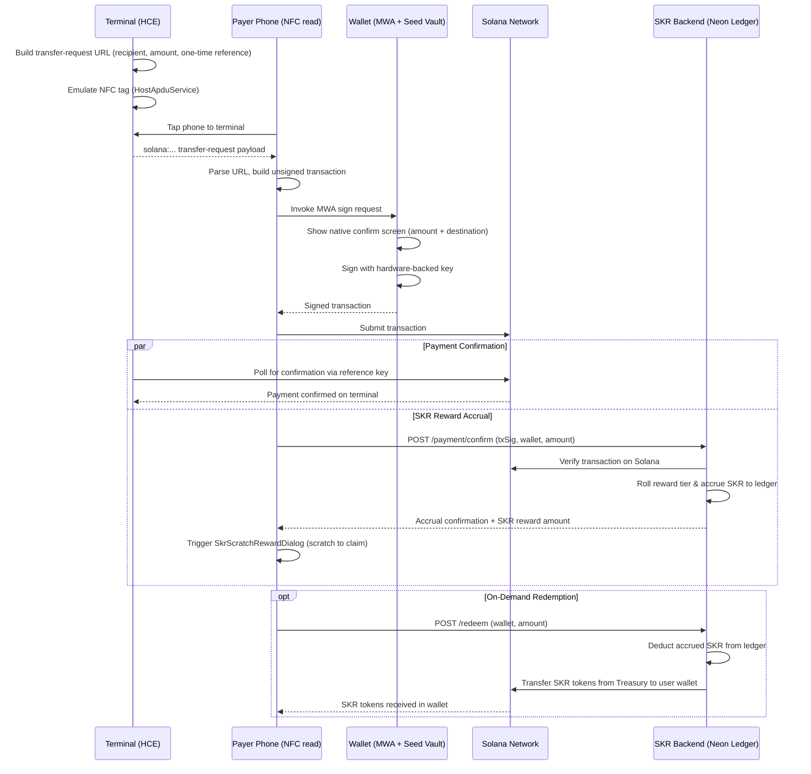

# APTO
### Hardware-secured NFC tap-to-pay for Solana Mobile

> Tap to send. No QR code, no typed address, no `.sol` name to spoof — the recipient's real key comes straight off the terminal, and every signature still happens inside hardware-backed secure storage.

---

## 1. Overview

APTO replaces two friction points in everyday Solana payments with a single NFC tap:

1. **Address/name spoofing** — Solana Name Service (SNS) makes payments human-readable (`alice.sol` instead of a 44-character key), but that convenience is exactly what lookalike-domain and address-poisoning scams exploit, since most wallets resolve the name silently and never show you the raw address to double-check.
2. **No native merchant checkout flow** — Solana Pay supports NFC as a transport in principle, but no wallet ships a built-in "walk up and tap" checkout experience the way Apple Pay/Google Pay do for cards. Every implementation today is a bespoke companion app.

APTO is that companion layer: an NFC reader/terminal app pair that constructs a standard Solana Pay transfer request, transmits it over NFC instead of a QR code, and hands off signing to whatever Mobile Wallet Adapter (MWA)-compliant wallet the user already has — Seed Vault on a Seeker device, or Phantom/Solflare/Backpack on any other NFC-capable Android phone.

**It is not a new payment rail.** It is a transport-and-UX layer sitting entirely in front of the existing Solana Pay + MWA stack. That's a deliberate scope choice — see Section 4.

---

## 2. Problem, precisely scoped

| Claim | What's actually true |
|---|---|
| "NFC solves SNS spoofing" | Only for **in-person, proximity payments**. The recipient's real pubkey is delivered directly by the terminal — there's no name-resolution step to spoof. It does **not** protect remote transfers to a `.sol` name over the internet, which is where most spoofing scams actually happen. |
| "No wallet supports tap-to-pay" | More precisely: no wallet needs to. Because signing routes through MWA, the wallet itself doesn't need any NFC code at all — the reader app does the NFC work and hands off a normal sign request. The actual gap is the missing reader/SDK layer, not wallet support. |

Being precise about this matters for judge Q&A — overclaiming either point is the fastest way to lose credibility on stage.

---

## 3. Why Solana Mobile specifically

This is the hardware story, and it's the part worth demoing live, not just describing:

- **Seed Vault** keeps private key material inside a hardware-backed secure element on Seeker devices. NFC never touches key material — it only ever carries an *unsigned* transfer request.
- **MWA is the trust boundary, not the transport.** Whether the sign request arrives via NFC tap or a QR scan, the wallet's own native confirmation screen (real amount, real destination) is what the user actually approves. Changing the transport doesn't weaken — or strengthen — that boundary; it's the same signing ceremony either way. The security value of this project is entirely in *what problem the transport solves* (spoofing, checkout friction), not in a claim that NFC itself is "more secure" than QR.
- **Distribution**: Seeker ships with Seed Vault and its own dApp store, so this can launch directly into an audience that already has a compatible wallet installed — no bootstrap problem for the demo.

---

## 4. Scope — v1

**In scope:**
- Android devices with NFC hardware (Host Card Emulation support required for the terminal role)
- Solana Mobile Seeker devices — primary hardware showcase target
- Any MWA-compliant wallet on the payer's side (no wallet-specific integration code)
- In-person, proximity transfers only (P2P tap and merchant-terminal tap)
- **SKR Loyalty & Reward Engine:** Ledger-based token rewards accrued upon confirmed tap-to-pay transactions, gamified scratch-card reveal, and treasury-backed SPL token redemptions directly to the payer's Solana wallet.

**Explicitly out of scope for v1:**
- **iOS.** Apple restricts third-party access to NFC host-card-emulation for payment-style use cases to Apple Pay's own certified path — there is no equivalent open HCE API for third-party apps the way Android's `HostApduService` allows. This isn't a resourcing decision, it's a platform constraint, and it's worth saying so directly rather than being vague about "Android-first."
- Non-NFC Android devices (a QR fallback is a reasonable stretch goal, not core to the pitch)
- Remote/non-proximity transfers
- Any custody of funds, fiat conversion, or cash handling — this is strictly non-custodial wallet-to-wallet or wallet-to-merchant transfer. If a merchant wants to convert received crypto to fiat, that's their own off-ramp relationship, not something this app touches. Keeping this out of scope is what keeps the legal footprint small.

---

## 5. Architecture

**Roles:**
- **Terminal** — the receiving side (a merchant register, or the other person's phone in a P2P tap). Emulates an NFC tag via Android `HostApduService`, broadcasting a Solana Pay transfer-request payload.
- **Payer** — reads the NFC payload, builds the transaction, and hands it to their installed wallet via MWA.
- **Wallet** — any MWA-compliant wallet (Seed Vault on Seeker, or Phantom/Solflare/Backpack elsewhere). Shows its own confirmation screen and signs with hardware-backed keys.
- **SKR Rewards Engine / Backend** — off-chain high-performance ledger (Node.js + Express + Neon PostgreSQL). Accrues SKR rewards upon verified transaction submission, determines tier-based bonus yields (Bronze, Silver, Gold, Platinum), and handles treasury-backed SPL token redemptions to user wallets without imposing per-tap on-chain transaction costs.

**Flow:**

```
1. Terminal builds a Solana Pay transfer-request URL:
   solana:<recipient>?amount=<amt>&spl-token=<mint>&reference=<one-time-key>&label=...&message=...

2. Terminal emulates an NFC tag broadcasting that URL (Android HCE).

3. Payer taps their phone to the terminal → Android NFC stack reads the payload.

4. Payer's app parses the URL, fetches a recent blockhash, builds the unsigned transaction.

5. Payer's app invokes Mobile Wallet Adapter → wakes the installed wallet.

6. Wallet shows its native confirm screen (real amount, real destination) → user approves.

7. Wallet signs using hardware-backed keys. Private key never leaves secure storage
   and is never exposed to the terminal, the payer's app, or the NFC layer.

8. Payer's app submits the signed transaction to Solana.

9. Terminal polls the chain for a transaction referencing its one-time `reference`
   key (standard Solana Pay pattern) to confirm payment — no data needs to flow
   back over NFC.

10. Payer app submits payment confirmation (tx signature + wallet address) to
    the SKR Backend API (`POST /payment/confirm`).

11. SKR Backend validates the on-chain payment, rolls a reward tier based on the
    transaction amount, and updates the user's ledger balance in Neon PostgreSQL.

12. Payer is presented with an interactive, gamified scratch card
    (`SkrScratchRewardDialog`) to reveal their newly earned SKR bonus.

13. Payer can view accrued lifetime SKR in the Rewards dashboard and execute on-demand
    redemption (`POST /redeem`), triggering automated treasury SPL token payout directly
    to their Solana wallet.
```

**Sequence diagram:**



---

## 6. Security model — what's mitigated, what's still open

Being upfront about the second column is what separates this from a demo that falls apart under judge questioning.

| Threat | Status | Mitigation |
|---|---|---|
| SNS name spoofing / address poisoning | Mitigated — proximity flow only | Recipient pubkey comes directly from the NFC payload; no name-resolution step exists in this flow at all |
| Blind signing (approving without reading) | Mitigated | Every signature still goes through the wallet's own native confirmation screen, regardless of transport |
| Replay of a static/printed NFC tag | Mitigated by design — must be implemented correctly | Every transfer request carries a single-use `reference` key per the Solana Pay spec; terminal generates a fresh reference per transaction with ephemeral HCE key signing |
| NFC relay attack (payload forwarded to a remote device) | **Mitigated via Micro-Timestamps** | Ephemeral nonce + millisecond APDU timestamp (<1200ms threshold) enforced before initiating MWA signing |
| Compromised / Rooted device | Mitigated | Android KeyAttestation & Play Integrity checks ensure execution in uncompromised TEE before Seed Vault access |
| Accidental / Pocket scans | Mitigated | Android BiometricPrompt pre-lock before NFC payload parsing or MWA prompt |
| Physical Coercion | Mitigated via Duress Mode | Panic fingerprint / Duress PIN triggers decoy connection or enforces micro-cap transfer ceiling |
| Private key exposure | Not applicable | Keys never leave hardware-backed storage (Seed Vault / TEE); NFC only ever carries an unsigned request |

---

## 7. Related work — know this before you pitch it

This is not greenfield, and pretending otherwise is the fastest way to lose credibility with a judge who's seen prior work:

- **Solana Pay** documents NFC-tag tap as a first-class transport alongside QR codes in its own spec.
- A public reference implementation ([TapWifSol](https://github.com/dpa9210/TapWifSol)) already demonstrates the same core pattern — phone-as-terminal, HCE tap or QR carrying the same transfer-request URL, MWA signing with "whatever wallet is already on the phone."
- Solflare sells a hardware NFC card wallet for tap-to-sign, and Flexa has shipped NFC-based crypto tap-to-pay at retail with third-party hardware wallets.

**What's actually differentiated here, and what to say when asked "isn't this already built":**
- The `reference`/anti-replay handling and **anti-relay micro-timestamps** are first-class design elements.
- **Hardware Enclave Integrity (KeyAttestation)** & **Biometric Pre-Locking** elevate hardware security beyond standard web/mobile apps.
- **SKR Token Reward & Loyalty Ledger:** Hybrid architecture pairing on-chain tap payments with a high-throughput, gas-free off-chain reward ledger (PostgreSQL on Neon). Users earn instant tiered SKR cashback with scratch-and-reveal gamification, which can be redeemed on-chain on demand via automated treasury payouts.
- **Offline Payment Intents** expand real-world utility for physical merchants in zero-connectivity environments.
- The security narrative is explicitly tied to Seed Vault and Seeker hardware, leading with spoofing-prevention.

---

## 8. Tech stack

- **Application Framework:** **Flutter (Dart)** for cross-platform UI, state management, and MWA client handling.
- **Terminal / reader app (HCE):** Native Android (`HostApduService`, `NfcAdapter`) integrated into Flutter via Android **MethodChannels**.
- **Payer NFC Reader:** Flutter [`nfc_manager`](https://pub.dev/packages/nfc_manager) package / custom APDU MethodChannel.
- **Transaction construction:** `@solana/web3.js` & Solana Dart SDK for building/parsing transfer-request URLs and assembling transfer instructions.
- **Signing:** Mobile Wallet Adapter (`solana_mobile_client`) client library — connecting directly to **Seed Vault** in TEE hardware.
- **Confirmation polling:** Standard RPC `getSignaturesForAddress` / `getTransaction` filtered by the `reference` key.
- **SKR Rewards Engine / Backend:** Node.js + Express + TypeScript, PostgreSQL on Neon (serverless database), protected via shared app API key (`APP_API_KEY`), and automated SPL token treasury payouts on Solana.
- **Rewards UI / UX:** Custom interactive scratch-card dialog (`SkrScratchRewardDialog`), high-precision numeric rolling counter animations (up to 5 decimal places), and dedicated redemption management.

---

## 9. Build plan (adjust to actual hackathon length)

- **Day 1:** NFC HCE broadcast + read working end-to-end (no Solana yet) — prove the hardware path first, since this is the part most likely to be flaky on demo day.
- **Day 2:** Wire in Solana Pay URL construction/parsing, MWA sign flow, reference-key generation and rotation.
- **Day 3:** Cross-wallet test (at least two different MWA wallets, live), polish the terminal UI, rehearse the demo end-to-end multiple times — NFC demos fail from device orientation/timing more often than from code.

Tell me the actual day count you have and this plan gets more specific.

---

## 10. Legal / compliance footnote

Strictly non-custodial, wallet-to-wallet or wallet-to-merchant transfer — no cash handling, no crypto-for-fiat conversion inside the app. That keeps this out of VASP/money-transmission territory. If a merchant wants to settle in fiat, that happens through their own registered exchange or payment processor, outside this app's scope.

---

## 11. Why this is worth putting in front of judges

A live tap that goes: **tap → wallet's own real confirmation screen appears with the correct destination → hardware-signed → confirmed on-chain**, demoed against two different actual wallets with no wallet-specific code, is a stronger 90 seconds than a slide about TAM. Lead with the spoofing-prevention story (it's specific and true), show the security table above unprompted so judges don't have to ask, and name the prior art yourself before they bring it up. A team that knows exactly what's already been built and states precisely what's different reads as more credible than a team claiming to have invented tap-to-pay.
