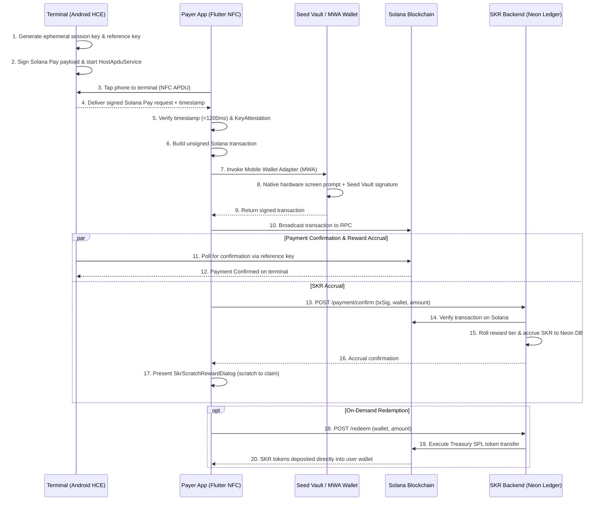

# APTO 📱⚡
### Hardware-Secured NFC Tap-to-Pay & Tap-to-Action for Solana Mobile

> **APTO** (derived from the Greek *äptō* / ἅπτω — "to touch", "to connect", "to grasp") is a Flutter-based mobile payment and interaction layer that turns NFC proximity taps into hardware-signed Solana transactions.

---

## 📌 1. Overview

Everyday Solana payments suffer from two major friction points:
1. **Address & Name Spoofing Risk:** Human-readable Solana Name Service (SNS) domains (e.g. `alice.sol`) and copied pubkeys are vulnerable to lookalike domain scams and address-poisoning attacks.
2. **Checkout Friction:** Most crypto payments require scanning QR codes, opening wallets manually, and copy-pasting addresses.

**APTO** transforms the Solana Mobile Seeker (and NFC-capable Android devices) into an instant tap-to-pay terminal and payer client. By combining **Android Host Card Emulation (HCE)**, **Solana Pay**, and **Mobile Wallet Adapter (MWA)**, APTO delivers a seamless tap experience where private keys never leave hardware-backed secure storage.

---

## 🔒 2. Hardware Safety & Security Architecture

APTO is engineered with defense-in-depth security mechanisms leveraging mobile hardware enclaves and cryptographic bounds:

### 🛡️ Hardware Attestation & Enclave Validation
* **The Threat:** Compromised, rooted, or emulated devices attempting to hook NFC channels or tamper with transaction payloads.
* **The Safety Measure:** APTO runs **Android KeyAttestation** and Play Integrity checks before initializing terminal HCE or Payer MWA calls. It verifies that the application is running inside an uncompromised Trusted Execution Environment (TEE) / StrongBox before Seed Vault interaction is allowed.

### ⏱️ Proximity-Binding & Anti-Relay Micro-Timestamps
* **The Threat:** **NFC Relay Attacks**, where an adversary relays an NFC APDU over high-speed Wi-Fi or Bluetooth to a remote victim device.
* **The Safety Measure:** Terminal payloads embed an **ephemeral nonce + high-precision millisecond timestamp**. The payer app enforces a strict latency window (e.g., `< 1200ms`) between reading the NFC tag and initiating the MWA signing flow. If the delta is exceeded, the payment session immediately self-destructs.

### 🔑 Dynamic Ephemeral HCE Session Signing
* **The Threat:** Attackers using static NFC sniffers to capture terminal payloads and attempt replay transactions.
* **The Safety Measure:** The terminal does not broadcast a static Solana Pay URL. Instead, the `HostApduService` generates short-lived session keys in the hardware keystore and cryptographically signs each HCE APDU payload. Each scan session generates a unique single-use `reference` key as per the Solana Pay specification.

### 🔐 Biometric Pre-Handoff Lock
* **The Threat:** Accidental near-field pocket taps or malicious proximity scans triggering unwanted MWA wallet prompts.
* **The Safety Measure:** High-value transfers or terminal broadcasts require **Android BiometricPrompt** verification (fingerprint or face unlock) before the NFC payload is processed or handed off to the installed wallet.

### 🚨 Anti-Coercion / Duress Protection
* **The Threat:** Physical safety risks where a user is forced under coercion to tap their phone and approve a transaction.
* **The Safety Measure:** Entering a pre-configured **Duress PIN** or using a designated **Panic Fingerprint** triggers a decoy mode. The app either simulates a generic connection failure or enforces a strict micro-cap ceiling while quietly dispatching an emergency alert hash to a designated oracle/guardian.

---

## 🚀 3. Real-World Features & Problem Solvers

Beyond simple tap-to-pay, APTO unlocks key features for real-world merchant and event adoption:

### ⚡ 1. Spoof-Proof Proximity Tap
* **Problem:** Address poisoning scams trick users into approving transactions to lookalike pubkeys.
* **Solution:** Recipient pubkeys are transmitted directly hardware-to-hardware over NFC. There is no domain resolution step to intercept or manipulate.

### 🎁 2. Tap-to-Pay + SKR Loyalty Rewards & Scratch Drops
* **Problem:** Merchants want loyalty programs, but customers dislike downloading separate apps or filling out forms, while on-chain rewards for every micro-payment cause excessive gas costs and chain congestion.
* **Solution:** APTO integrates the **SKR Reward Engine**:
  1. Main payment transfer executes on-chain via NFC tap-to-pay.
  2. Transaction signature is verified by the backend (`POST /payment/confirm`), rolling a tiered reward (Bronze, Silver, Gold, Platinum) and accruing SKR into a Neon PostgreSQL ledger.
  3. Customer receives an interactive, gamified scratch card (`SkrScratchRewardDialog`) to reveal their instant bonus.
  4. Users accumulate SKR and redeem on demand (`POST /redeem`) directly to their Solana wallet via automated treasury payouts.

### 📡 3. Offline "Tap-and-Hold" Intent
* **Problem:** Poor cellular coverage at crowded festivals, subways, or stadiums causes network timeouts during payment checkout.
* **Solution:** Payer and terminal exchange a cryptographically signed **Offline Payment Commitment**. The payer signs an offline transaction intent via Seed Vault, and the terminal or payer broadcasts the queued transaction to Solana RPC as soon as connectivity is restored.

### 🕵️ 4. Stealth Recipient (Ghost Mode Privacy)
* **Problem:** Standard Solana Pay broadcasts fixed merchant wallets, allowing anyone to inspect total store revenue and wallet history on Solscan.
* **Solution:** Terminals generate dynamic ephemeral stealth receiving sub-accounts derived from master keys, ensuring on-chain privacy for physical merchants.

### 🎟️ 5. Tap-to-Action (Airdrops & Event Access)
* **Problem:** Event organizers need fast, cryptographic check-in and proof-of-attendance (POAP) distribution.
* **Solution:** APTO operates in **Action Mode**, allowing users to tap to verify dApp store assets, prove event ticket ownership, or claim location-bound token drops.

---

## 🛠️ 4. Tech Stack & Implementation

APTO is built with **Flutter** for cross-platform UI agility, combined with **Native Android Channels** for low-level NFC Host Card Emulation.

```
+-------------------------------------------------------------------+
|                        APTO Flutter App                           |
|  +-----------------------+     +-------------------------------+  |
|  |   Flutter UI Layer    |     |  Solana Dart / Web3 Client    |  |
|  +-----------+-----------+     +---------------+---------------+  |
+--------------|---------------------------------|------------------+
               | MethodChannels                  | Mobile Wallet Adapter
+--------------v-----------------+     +---------v------------------+
| Android Native HostApduService |     | Seed Vault / TEE Enclave  |
| (NFC HCE Terminal Broadcast)   |     | (Hardware Private Key)    |
+--------------------------------+     +----------------------------+
```

* **Frontend:** Flutter (Dart) — Responsive mobile UI, state management, transaction receipt rendering.
* **NFC HCE Terminal:** Android Native `HostApduService` via MethodChannels (broadcasting dynamic Solana Pay URL over APDU).
* **NFC Payer Reader:** Flutter `nfc_manager` plugin.
* **Hardware Signing:** Solana Mobile Wallet Adapter (`solana_mobile_client`) connecting directly to **Seed Vault** on Seeker devices.
* **Blockchain Layer:** Solana RPC, `@solana/web3.js` & Solana Dart SDK for transaction building and reference polling.
* **SKR Rewards Engine:** Express.js + Node.js/TypeScript backend backed by Neon PostgreSQL, shared app API key authorization (`APP_API_KEY`), and automated SPL token treasury payouts on Solana.

---

## 📂 5. Recommended Project Directory & File Structure

Below is the modular, feature-first Flutter + Native Android file structure for APTO:

```
apto/
├── android/                             # Native Android Platform Layer
│   └── app/src/main/kotlin/com/apto/
│       ├── MainActivity.kt               # FlutterActivity & MethodChannel bridge setup
│       ├── nfc/
│       │   ├── AptoHostApduService.kt    # Android HostCardEmulation (HCE) NFC service
│       │   └── NfcPayloadEncoder.kt      # Formats APDU responses with ephemeral session keys
│       └── security/
│           ├── HardwareAttestation.kt    # Android KeyAttestation & Play Integrity checks
│           └── BiometricHandler.kt       # Native BiometricPrompt helper
│
├── lib/                                 # Flutter Application Code (Dart)
│   ├── main.dart                        # App Entry Point & Dependency Injection (GetIt/Riverpod)
│   │
│   ├── core/                            # Shared utilities, constants, theme & security engines
│   │   ├── constants/
│   │   │   ├── app_colors.dart          # Design system & dark mode tokens
│   │   │   └── solana_config.dart       # RPC endpoints, cluster config & program IDs
│   │   ├── security/
│   │   │   ├── attestation_service.dart # KeyAttestation MethodChannel interface
│   │   │   ├── biometric_service.dart   # Biometric authentication wrapper
│   │   │   └── anti_relay_checker.dart  # Micro-timestamp latency (<1200ms) validator
│   │   ├── network/
│   │   │   └── solana_rpc_client.dart   # Solana RPC connection manager
│   │   └── theme/
│   │       └── app_theme.dart           # Modern dark-mode Flutter theme
│   │
│   ├── features/                        # Modular Feature Domains
│   │   │
│   │   ├── terminal/                    # Merchant / Receiver Role (HCE Broadcast)
│   │   │   ├── bloc/
│   │   │   │   ├── terminal_bloc.dart   # Controls HCE broadcast state & payment polling
│   │   │   │   └── terminal_state.dart
│   │   │   ├── services/
│   │   │   │   └── hce_service.dart     # MethodChannel controller for AptoHostApduService
│   │   │   └── presentation/
│   │   │       ├── pages/
│   │   │       │   ├── terminal_page.dart         # Merchant payment entry screen
│   │   │       │   └── terminal_active_page.dart  # Active NFC broadcast UI
│   │   │       └── widgets/
│   │   │           ├── amount_input_pad.dart      # Custom numeric keypad
│   │   │           └── nfc_pulse_animation.dart   # Dynamic radar pulse wave UI
│   │   │
│   │   ├── payer/                       # Customer / Payer Role (NFC Reader)
│   │   │   ├── bloc/
│   │   │   │   ├── payer_bloc.dart      # Manages tap detection, validation & MWA state
│   │   │   │   └── payer_state.dart
│   │   │   ├── services/
│   │   │   │   ├── nfc_reader_service.dart    # Wraps nfc_manager APDU scanner
│   │   │   │   └── offline_intent_store.dart  # Local encrypted cache for offline tap intents
│   │   │   └── presentation/
│   │   │       ├── pages/
│   │   │       │   ├── tap_reader_page.dart     # Customer tap screen
│   │   │       │   └── payment_success_page.dart# Hardware receipt & cNFT reward screen
│   │   │       └── widgets/
│   │   │           ├── merchant_info_card.dart  # Real-time merchant pubkey display
│   │   │           └── tap_to_pay_banner.dart
│   │   │
│   │   ├── solana_pay/                  # Solana Pay & MWA Core Integration
│   │   │   ├── models/
│   │   │   │   ├── solana_pay_request.dart  # SolPay URL model & APDU payload decoder
│   │   │   │   └── payment_reference.dart   # Single-use reference key model
│   │   │   ├── services/
│   │   │   │   ├── mwa_signing_service.dart # Solana Mobile Wallet Adapter (Seed Vault) bridge
│   │   │   │   ├── transaction_builder.dart # Builds payment + cNFT reward instructions
│   │   │   │   └── reference_poller.dart    # Real-time RPC transaction listener
│   │   │   └── repository/
│   │   │       └── solana_pay_repository.dart
│   │   │
│   │   └── rewards/                     # SKR Loyalty, Gamified Scratch Drops & Ledger
│   │       ├── models/
│   │       │   └── reward_history_item.dart
│   │       ├── services/
│   │       │   └── skr_reward_service.dart   # Backend API client for payment confirmation & redemption
│   │       └── presentation/
│   │           ├── pages/
│   │           │   └── skr_reward_page.dart  # Rewards dashboard with live rolling counters
│   │           ├── dialogs/
│   │           │   ├── skr_scratch_reward_dialog.dart  # Interactive scratch-and-reveal modal
│   │           │   └── redemption_success_dialog.dart   # Treasury payout receipt
│   │           └── utils/
│   │               └── skr_format_utils.dart # Precision 5-decimal formatter
│   │
│   └── shared/                          # Global widgets & reusable components
│       ├── widgets/
│       │   ├── apto_button.dart
│       │   ├── hardware_security_badge.dart # Displays KeyAttestation & Seed Vault status
│       │   └── duress_pin_dialog.dart       # Anti-coercion panic PIN trigger dialog
│       └── models/
│           └── device_security_status.dart
│
├── pubspec.yaml                         # Flutter dependencies (solana_mobile_client, nfc_manager, etc.)
└── README.md
```

---

## 📋 6. System Flow



---

## ⚖️ 7. Compliance & Non-Custodial Scope

APTO is strictly a **non-custodial transport and user experience layer**:
- No custody of user or merchant funds.
- No direct fiat conversion or money transmission within the app.
- Private keys never leave the hardware enclave.
- All signing authority remains strictly with the user's MWA-compliant wallet.

---

## 📜 8. License

Distributed under the MIT License. See `LICENSE` for details.

